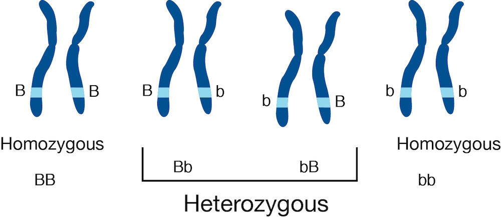

```{r, include = FALSE}
knitr::opts_chunk$set(
  collapse = TRUE,
  comment = "#>"
)
```

## Overview

### Description

In this workshop, we will cover a newly developed suite of tools for
performing analysis of allelic expression in Bioconductor. You will
learn about how we use upstream tools like `g2gtools` and `Salmon` to
quantify allelic expression for RNA-seq, and then how to explore the
data in R using the `fishpond` package. Altogether we call this suite
of tools *SEESAW* for
"Statistical Estimation Of allelic Expression Using Salmon And sWish".

### Background and other methods

The SEESAW set of methods for quantifying and analyzing allelic data
is similar to 
[mmseq](https://github.com/eturro/mmseq), 
in which uncertainty of assignment of reads to isoforms and alleles is
estimated, stored, and using in statistical testing.
It is also similar to 
[EMASE](https://emase.readthedocs.io/en/latest/index.html), which
provides quantification at isoform and allele level;
SEESAW also use the same upstream pipeline as EMASE for construction
of diploid reference transcripts.

Our approach differs from existing methods for detecting allelic
imbalance in RNA-seq data such as 
[WASP](https://github.com/bmvdgeijn/WASP)
or the Bioconductor package
[AllelicImbalance](https://www.bioconductor.org/packages/AllelicImbalance),
in that we do not focus on pileup of reads on particular SNPs, but
instead integrate the isoform- and allele-level information contained
in reads aligning to entire transcripts (including both SNP and indel
variation). However, these existing methods can be used across
patients with different genomes, while the SEESAW methods are designed
for analyzing replicate samples with the same diploid genomes (e.g. F1
crosses, or time series of human cell lines).

A recent method for isoform- and allele-level testing is the
Bioconductor package
[PAIRADISE](https://www.bioconductor.org/packages/PAIRADISE),
which quantifies reads that contain both allelic and isoform-level
information: those that contain both a heterozygous SNP and a splice
juntion.
Another relevant recently developed method is
[ASEP](https://github.com/Jiaxin-Fan/ASEP),
which allows for gene-level allelic imbalance detection, accounting
for unknown genotype of other nearby regulatory variants.
PAIRADISE and ASEP are therefore applicable across populations of
genotypically diverse individuals. We link to these publications for
background reading below.

### Pre-requisites

* Some basic background of RNA biology, e.g. what are genes, what are isoforms/transcripts?
* Some familiarity with RNA-seq data, e.g. what are reads?
* Some familiarity with working with *SummarizedExperiment* objects will help.

### Background reading

* [Tools and best practices for data processing in allelic expression analysis](https://doi.org/10.1186/s13059-015-0762-6)
* [A vast resource of allelic expression data spanning human tissues](https://doi.org/10.1186/s13059-020-02122-z)
* [Haplotype and isoform specific expression estimation using multi-mapping RNA-seq reads](https://doi.org/10.1186/gb-2011-12-2-r13) (mmseq)
* [Hierarchical analysis of RNA-seq reads improves the accuracy of allele-specific expression](https://doi.org/10.1093/bioinformatics/bty078) (EMASE)
* [Detecting Allele-Specific Alternative Splicing from Population-Scale RNA-Seq Data](https://doi.org/10.1016/j.ajhg.2020.07.005) (PAIRADISE)
* [ASEP: Gene-based detection of allele-specific expression across individuals in a population by RNA sequencing](https://doi.org/10.1371/journal.pgen.1008786)

### Participation

The format is lecture + lab, with time for data exploration.

### _R_ / _Bioconductor_ packages used

* SummarizedExperiment
* fishpond
* plyranges
* pheatmap
* Gviz

### Time outline

An example for a 45-minute workshop:

| Activity                     | Time |
|------------------------------|------|
| Intro to allelic quant       | 15m  |
| Exploration of data in R     | 15m  |
| Testing and visualization    | 15m  |

### Workshop goals and objectives

### Learning goals

* understand why analyzing allelic expression can be useful for
  learning about *cis* genetic regulation
* understand differences between approaches to allelic quantification
* understand difference among types of allelic imbalance tests,
  e.g. "global", "differential", and "dynamic" imbalance

### Learning objectives

* import allelic quantification data into R
* exploratory analysis of allelic data with uncertainty
* statistical testing for allelic imbalance across samples
* exploration of testing results with heatmaps and genome browser
  plots 

## What is allelic expression

```{r, echo=FALSE, fig.alt="Diagram of chromosomes with homozygous and heterozygous alleles, from URL: https://commons.wikimedia.org/wiki/File:Heterozygous.jpg"}

```

Let us assume for this workshop that we are studying a diploid
organism, and we focus on the genes with two copies (so genes on the
autosome, and e.g. chrX for XX individuals). We do not consider here
allelic quantification in cases of complex copy number such as tumor
gene expression. 

In most RNA-seq pipelines, we are concerned with *total expression* of
genes or transcripts, where we do not distinguish between RNA
transcripts from either of the two chromosomes. Suppose the light blue
region highlighted above is a gene, and there are two alleles (B and
b) which differ by one or more genetic variants. In the case that
there are genetic variants falling within the exons of the gene, some
RNA-seq reads may contain information that allows us to determine the
origin of the RNA transcript, whether from the B chromosome or the b
chromosome. Typically, RNA-seq analysis pipelines just are concerned
with counting reads aligning to the light blue region, regardless of
which chromosome. Some pipelines will attempt to identify which splice
isoforms these align to, but do not attempt to distinguish between
alleles. 

In SEESAW (and mmseq and EMASE) we attempt to distinguish both allele
and isoform from the RNA-seq reads. Again, note that, while there is
always expression from two alleles, only in the middle two cases
above, with one or genetic variants falling in the exons of the
highlighted gene, can we recover allelic information from RNA-seq
reads. In this workshop, we will therefore look at two counts per
sample, one count for the `a2` or reference allele, and the other
count for the `a1` or alternate allele. In our case, the reference
will be the C57BL/6J (or "B6") mouse genome, and the alternate allele
will be the CAST/EiJ mouse genome (we will focus on the B6xCAST F1
hybrid mouse).

## Allelic imbalance

The expression of the two alleles may differ for a variety of
reasons. Imagine a single cell with two copies of a gene that may be
transcribed. You may be familiar with the concept of "transcriptional
bursting":

> Mammalian gene expression is inherently stochastic, and results
> in discrete bursts of RNA molecules that are synthesized from each
> allele.

-Larsson *et al.* "Genomic encoding of transcriptional burst
kinetics." *Nature* **565**, 251–254 (2019) 
<https://doi.org/10.1038/s41586-018-0836-1>.
(Other papers describing the stochastic nature of expression from each
allele are the 
[SCALE](https://doi.org/10.1186/s13059-017-1200-8) and 
[scBASE](https://doi.org/10.1038/s41467-019-13099-0) 
method papers.)

We might expect that these stochastic differences between the two
alleles would average out if we look at many cells, as in bulk
RNA-seq. But in some cases, we may see systematic differences between
the two alleles. Some reasons why:

1. Interesting biological differences
2. Technical artifacts

As in 
[Figure
1](https://genomebiology.biomedcentral.com/articles/10.1186/s13059-015-0762-6/figures/1)
of Castel *et al.* (2015), the largest differences seen in allelic
imbalance are likely mapping bias or genotyping errors (e.g. #2
above). If we map reads to the reference genome, then we will
generate a systematic bias where reads from the alternate allele will
tend to have lower counts. Likewise, if one of the two genomes has
lower quality, even if we map reads to both genomes or transcriptomes
(as in SEESAW) we will see a systematic bias towards the higher
quality genome. Here we assume both genomes are equally free of
errors, but assessing systematic bias is an important part of allelic
analysis (e.g. histograms or MA plots of the difference between the
mapping rate of the two alleles across all genes).

However, of the type #1 above, there are some possibilities for the
source of allelic differences in RNA abundance:

* Epigenetic (e.g. the common example of chrX inactivation)
* Nonsense-mediated decay (NMD)
* *Cis*-genetic regulation (cGR)

In the first case, one allele is genomically imprinted, which may
involve DNA methylation and histone modifications depending on the
species. In the second and third case, RNA is often produced from both
alleles, but one is degraded at a higher rate (NMD) or produced at a
higher rate (cGR). 

Our motivation in developing SEESAW was particular on detecting cGR,
as we are interested in how non-coding variants *cis* to a gene may
affect transcription. These could affect transcription through
alteration of transcription factor binding sites (TFBS) or through
changes to splicing. While both TFBS and splicing changes are of
interest, in this workshop we will focus on non-coding variation that
affects TFBS and therefore modulates transcriptional activity at the
promoter.

We therefore will focus on cases where there is allelic imbalance of a
transcript, and we can detect this imbalance with RNA-seq (center two
cases in the above diagram), and we hypothesize that this imbalance is
the result of a heterozygous variant in some regulatory region of the
gene. As we only focus here on RNA-seq, we will not have additional
data that allows us to locate the source of the regulatory change
across the two alleles. For this, it would be useful to have
complementary ATAC-seq or ChIP-seq (if a particular TF is of
interest).

## SEESAW pipeline

At the beginning of the workshop, we will give an overview of the
steps that need to take place outside of R, before we import the
allelic data into Bioconductor. These are outlined as the first parts
of the pipeline in the diagram below. These are also described in
detail in the 
[allelic vignette](https://mikelove.github.io/fishpond/articles/allelic.html) 
for the fishpond package.

The input to the pipeline of methods is RNA-seq data (FASTQ files),
information about the diploid reference genome (e.g. VCF file), and
information about the isoforms (e.g. GTF file). The SEESAW suite of
methods is currently designed to work for experiments with multiple
replicates of samples with the same diploid genome, e.g. F1 crosses,
or time series of human cell lines.

The R code below will begin at the center blue square with
`importAllelicCounts()`, assuming that diploid quantification with
bootstrap replicates for uncertainty has already been performed.

```{r, echo=FALSE, fig.alt="Diagram of SEESAW pipeline, including g2gtools, Salmon index, Salmon quant, and import into Bioconductor using fishpond package funcctions"}
knitr::include_graphics("images/SEESAW.png")
```

Links to relevant software: 

* [g2gtools](http://churchill-lab.github.io/g2gtools/) for
  constructing the diploid transcriptome
* Salmon, run with [bootstrap inferential replicates](https://salmon.readthedocs.io/en/latest/salmon.html#numbootstraps)

## Importing allelic counts

The following five un-evaluated code chunks were used to import the
allelic quantification from Salmon into R. These are un-evaluated, as
the original data is too large to include in this package.

First, we define `coldata` and `txps`, which describe the sample
metadata, and the genomic ranges of the transcripts that were
quantified (the haploid reference transcripts). We do not yet have a
convenient way to describe the location of the transcripts in the
diploid genome, so we still rely on a single reference genome here,
although a diploid genome was used for quantifying allelic expression.

```{r eval=FALSE}
# `files` points to `quant.sf` files in original Salmon directories
# other vectors here describe the samples
coldata <- data.frame(cross, day, files, names)
ah <- AnnotationHub()
#query(ah, c("EnsDb","102","Mus musculus"))
edb <- ah[["AH89211"]]
txps <- transcripts(edb)
```

We can group to the gene level with the following `group_id`:

```{r eval=FALSE}
library(plyranges)
txps <- txps %>%
  select(tx_id, group_id=gene_id)
```

The following code chunk imports the allelic data, creating a "wide"
*SummarizedExperiment* object which will have 2x the number of columns
as the samples listed in `coldata`. We specify the strings that
distinguish the `a1` and `a2` allele in the transcript FASTA file 
(these are suffices that follow the transcript name, separated with an
underscore, e.g. `ENST123_ref` and `ENST123_alt`.
By convention, the `a2` allele describes the reference allele.
In the `gse` object (gene-level SummarizedExperiment), the `a2`
allelic counts will appear as the first columns followed by the `a1`
allelic counts. Here we supply `txps` as a *GRanges* object with a
metadata column `group_id` that describes how we collapse
transcript-level counts.


```{r eval=FALSE}
library(fishpond)
gse <- importAllelicCounts(
  coldata, a1="alt", a2="ref",
  format="wide", tx2gene=txps,
)
```

Finally, we performed minimal filtering on the features:

```{r eval=FALSE}
# filtering out lowly expressed features:
keep <- rowSums(assay(gse) >= 10) >= 6
table(keep)
gse <- gse[keep,]
```

Alternatively, we can group transcript-level counts to the
transcription start site (TSS) level
using the following code chunk to define `txps`. `makeTx2Tss()` is a
convenience function in *fishpond*. The `maxgap=50` argument means we
will group together transcripts that have TSS that fall within 50bp of
each other.

```{r eval=FALSE}
txps <- makeTx2Tss(edb, maxgap=50) %>%
  select(tx_id, gene_id, group_id, tss)
```

**Q: why would we want to collapse to TSS level?**

## Mouse osteoblast differentiation

We have two pre-packaged datasets as part of this workshop
package, one where allelic counts from an RNA-seq experiment are
summarized to the gene level, and another where they are summarized to
the TSS level.

The datasets are described in the man pages (see References tab).
Briefly, mouse osteoblast cells were differentiated over a time course
from day 2 to day 18. The data has been subset to just the genes on
chr1. A reference for the experiment is:

> Kemp JP, Medina-Gomez C, Estrada K, St Pourcain B et al.
> Phenotypic dissection of bone mineral density reveals skeletal site specificity
> and facilitates the identification of novel loci in the genetic regulation of
> bone mass attainment. PLoS Genet 2014 Jun;10(6):e1004423. PMID: 24945404
> <https://www.ncbi.nlm.nih.gov/pmc/articles/PMC4063697/>

...more about osteoblasts and their genetic importance...

**Q: why would we be interested in allelic expression during
osteoblast differentiation?**

## Explore allelic counts

We load the gene-level dataset created with `importAllelicCounts()`:

```{r message=FALSE}
library(SummarizedExperiment)
library(Bioc2022AllelicExpression)
data(osteoblast_gene_chr1)
osteoblast_gene_chr1
g <- osteoblast_gene_chr1
```

The sample metadata:

```{r}
colData(g)
```

For each sample and each allele, we have counts and also bootstrap
replicates. The bootstrap replicates are from Salmon, by specifying
`--numBootstraps 30` during quantification. 

**Q: Why do we need bootstrap replicates?**

We can use *fishpond* functions to do some basic exploration of the
allelic counts. 

```{r histBoot}
library(fishpond)
assayNames(g)
dat <- getTrace(g, idx=1, samp_idx="129xB6-d02-a2")
hist(dat$count, border="white", col="grey50", xlab="estimated count, a2")
```

This plot shows the distribution of estimated counts for the first
feature, and for the day 2 sample of the 129xB6 cross, reference allele.
We can also visualize the distributions for all samples using
`plotInfReps()`:

```{r plotInfReps}
plotInfReps(g, idx=1, x="allele", legend=TRUE)
```

We can also group the allelic counts ordered by sample, e.g.:

```{r plotInfReps2}
gcast <- g[,g$cross == "CASTxB6"]
plotInfReps(gcast, idx=1, x="allele", cov="day", legend=TRUE)
```

In the above plot, the samples are ordered by sample, as if `day` x
`allele` were a categorical variable. We can also plot `day` on its
original continuous scale. To do so, we use points and lines to
represent the bootstrap distribution instead of boxplots. To draw the
line, we need to first compute the bootstrap variance, which can be
computed with the `computeInfRV()` function (InfRV = "inferential
relative variance", a useful diagnostic for comparing uncertainty
across features):

```{r plotInfReps3}
gcast <- computeInfRV(gcast)
plotInfReps(gcast, idx=1, x="day", cov="allele",
            shiftX=.2, legend=TRUE)
```

## Filter non-informative features

Some features have no sequence difference between the two alleles. One
easy way to detect these is to look at a single bootstrap replicate,
e.g. the first one `infRep1`. If this bootstrap sample gives the same
count to each allele, across all samples, this implies either that the
sequence was identical across alleles, or there were no reads covering
the part of the transcript sequence that contains a difference across
alleles. We remove these from the dataset, as they are non-informative
for allelic imbalance analysis.

```{r}
n <- ncol(gcast)/2
rep1a1 <- assay(gcast, "infRep1")[, gcast$allele == "a1" ]
rep1a2 <- assay(gcast, "infRep1")[, gcast$allele == "a2" ]
someInfo <- rowSums(abs(rep1a1 - rep1a2) < 1) < n
table(someInfo)
gcast <- gcast[ someInfo, ]
```

